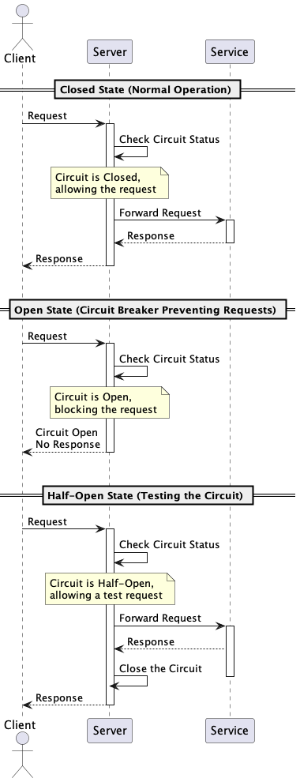

# Circuit Breaker

The Circuit Breaker Pattern is a design pattern used in software development to enhance the resilience of a system by
handling faults and preventing cascading failures. It's like a fuse in an electrical circuit, breaking the connection
when something goes wrong to prevent further damage.

## States

- **Closed State:** In normal operation, the circuit breaker is closed, allowing requests to flow through.
- **Open State:** If a predefined error threshold is reached, the circuit breaker opens, blocking any further requests
  and preventing potential damage.
- **Half-Open State:** After a cooldown period, the circuit breaker transitions to a half-open state, allowing a limited
  number of requests to pass through. If they succeed, the breaker switches back to closed; otherwise, it remains open.

### Diagram

## Quality Attributes

- **Fault Tolerance:** Enhances the system's ability to withstand and recover from faults.
- **Resilience:** Improves the system's ability to adapt and recover from failures gracefully.
- **Availability:** Minimizes downtime by isolating faulty components and preventing widespread failures.

## Cons

- **Complexity:** Introducing a circuit breaker adds complexity to the system, requiring careful configuration and
  maintenance.
- **Maintenance:** Circuit breakers must be inspected and maintained regularly to ensure their proper functioning.

## When to Use

This pattern is employed when avoiding a dependency on resources, such as an overloaded HTTP request or a database
query. We shouldn't continue receiving more requests if we won't be able to fulfill them. If our goal is to reduce the
system's waiting time during overload, this pattern can be the solution we are looking for. It is ideal when we need a
system that is resistant to overloads.

## Docs

- [CircuitBreaker by Martin Fowler](https://martinfowler.com/bliki/CircuitBreaker.html)
- [The Pros and Cons of the Circuit Breaker Pattern](https://www.redhat.com/architect/circuit-breaker-architecture-pattern)
